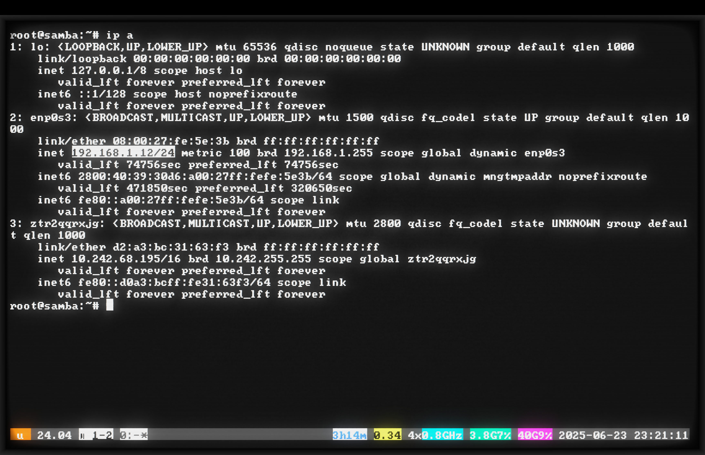
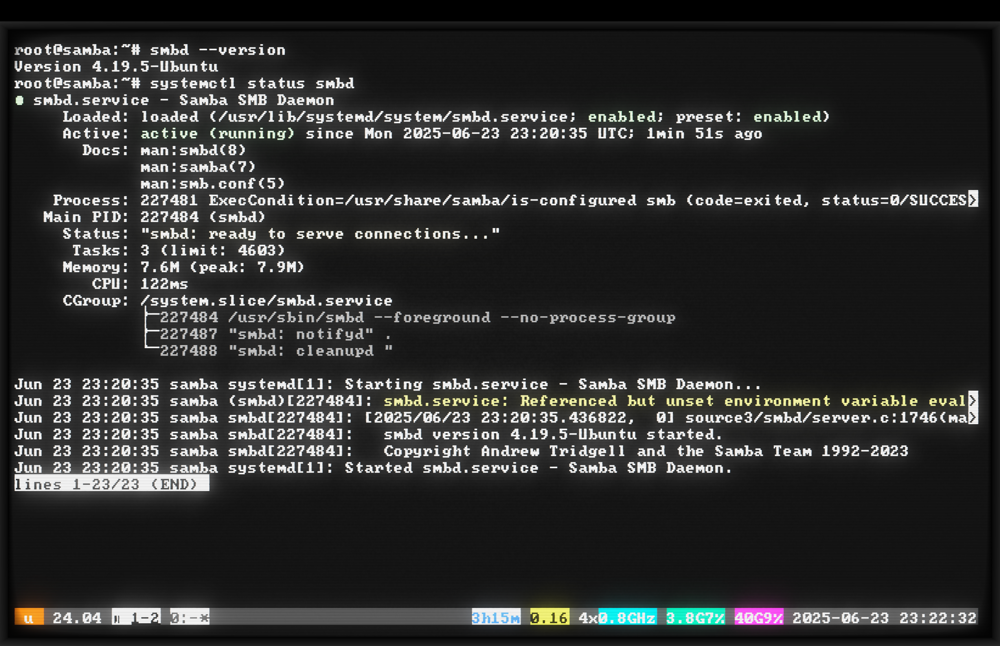
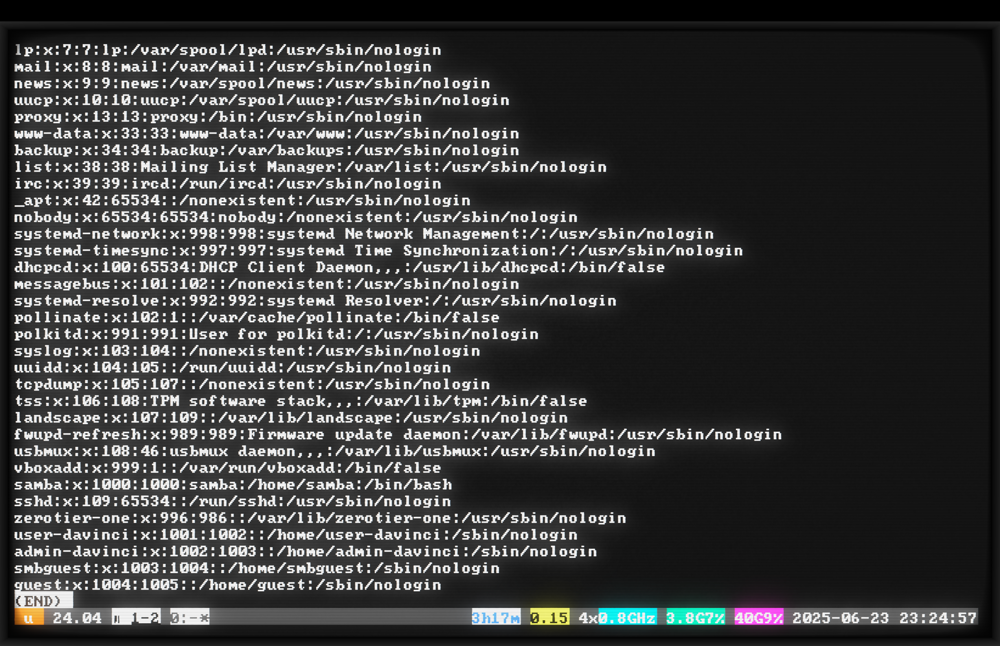
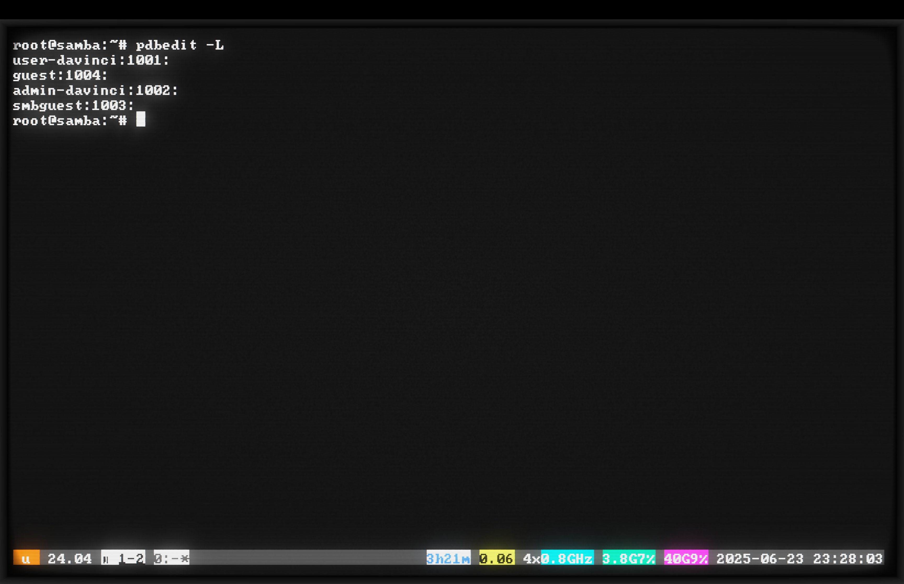
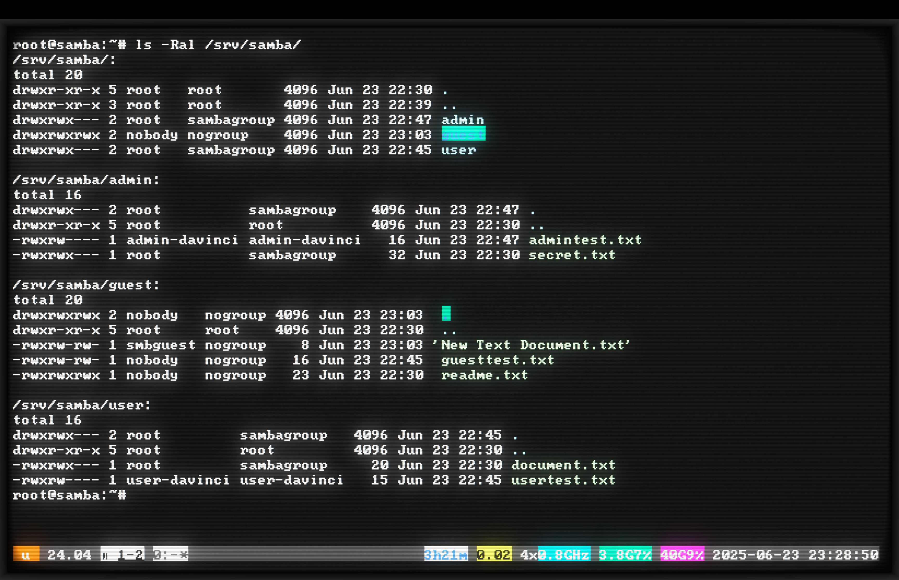
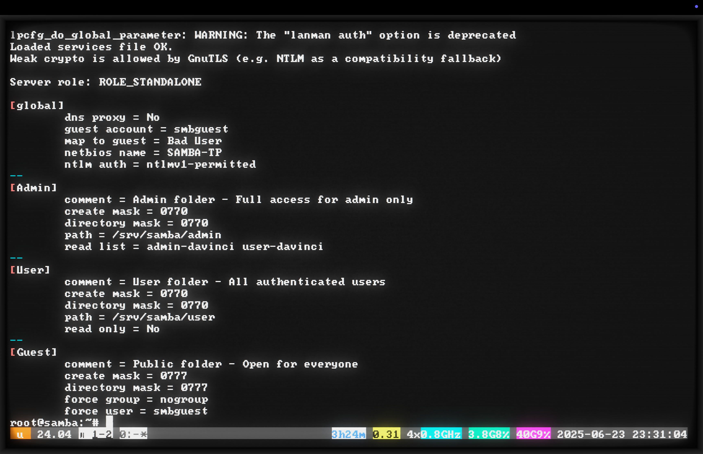
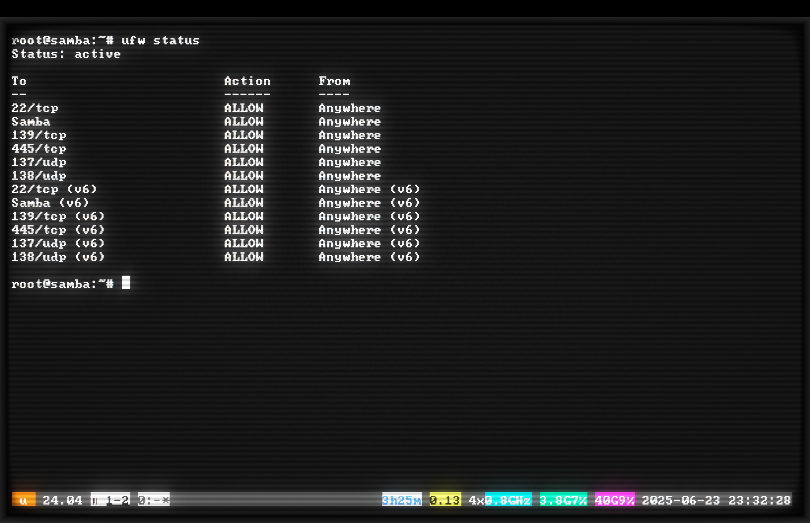
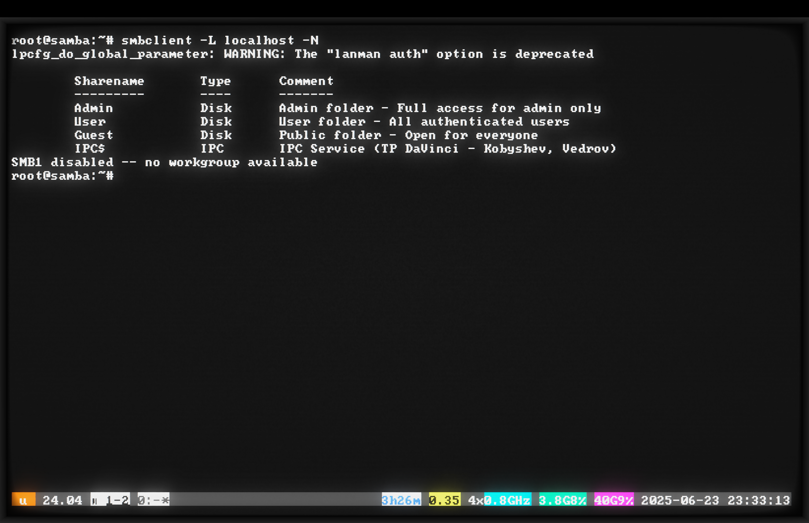
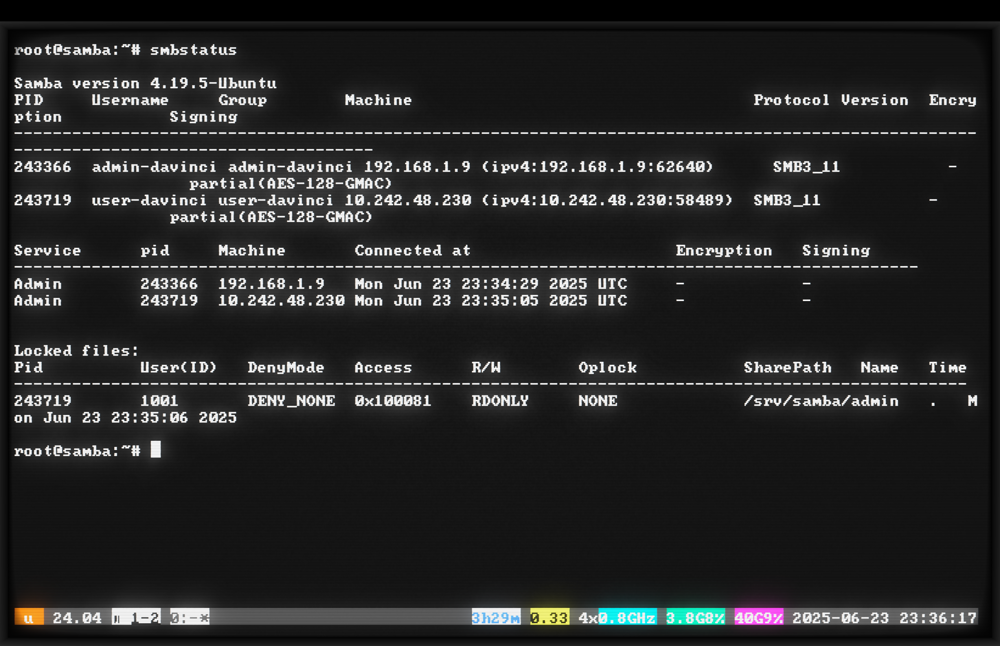

# Informe sobre la configuración del servidor de archivos Samba
## ACN3AP
## TP 2DO PARCIAL - Escuela DaVinci 2025
### Realizado por: Andrei Kobyshev, Dmitriy Vedrov

---

## Introducción

Desde niño me fascinaron las computadoras. Recuerdo el aula de informática de la escuela con procesadores 386, el brillo verde de los monitores CRT y Norton Commander. Esta nostalgia me llevó a usar cool-retro-term, un emulador de terminal que recrea el efecto de los antiguos monitores CRT con su característico parpadeo, distorsiones en los bordes y cálido brillo de tubo. ¡Trabajar en una terminal así es un placer especial para un geek de la vieja escuela!

Para realizar la tarea de crear un servidor de archivos, elegí la combinación probada de VirtualBox + Ubuntu Server. Ya había trabajado con VirtualBox antes: la interfaz es comprensible, funciona de manera estable y soporta todas las funciones necesarias, incluido el Bridged networking.

## Elección e instalación del sistema

### Elección del SO
Me decidí por Ubuntu Server 24.04 LTS: la última versión con soporte a largo plazo, requisitos mínimos de recursos, excelente soporte para Samba.

### Creación de la máquina virtual
En VirtualBox creé una VM con los siguientes parámetros:
- RAM: 4 GB
- HDD: 40 GB
- Red: **Bridged Adapter**

La configuración del adaptador de red en modo Bridge es un momento crítico. A diferencia del NAT estándar, el modo Bridge permite a la máquina virtual:
- Obtener su propia dirección IP directamente del router a través de DHCP
- Ser visible para todos los dispositivos en la red local
- Comportarse como si fuera una computadora física real conectada a la red

Sin esta configuración, otras computadoras simplemente no podrían encontrar nuestro servidor Samba en la red. La máquina virtual estaría aislada detrás de NAT, y el acceso a ella solo sería posible desde el sistema host.

### Instalación de Ubuntu Server
Descargué la imagen ISO del sitio oficial ubuntu.com/download/server. Elegí específicamente la versión Server: sin interfaz gráfica, solo línea de comandos. Esto ahorra recursos y hace que el sistema sea más estable para tareas de servidor.

El proceso de instalación es estándar. Creé el usuario `samba` con contraseña `samba`. Activé OpenSSH Server durante la instalación: marqué la casilla cuando el instalador lo ofreció.

## Configuración de red y conexión

Después del primer arranque, configuré el acceso conveniente:

```bash
# Verifiqué la dirección IP
ip a
# Obtuve 192.168.1.12

# Desde mi computadora principal configuré las claves SSH
ssh-copy-id samba@192.168.1.12
```

El comando ssh-copy-id copia mi clave SSH pública al servidor en el archivo authorized_keys. Esto permite conectarse sin ingresar la contraseña cada vez: la autenticación se realiza mediante clave. Conveniente y seguro: no es necesario ingresar constantemente la contraseña, y nadie podrá adivinar la contraseña por fuerza bruta.

Me conecté al servidor y ejecuté byobu:

```bash
ssh samba@192.168.1.12
byobu
sudo -i  # Cambié a root para mayor comodidad
```

Byobu es una envoltura mejorada sobre screen/tmux que crea una sesión de terminal persistente. La principal ventaja: si la conexión SSH se interrumpe (por ejemplo, problemas de red), todos los procesos en ejecución continuarán funcionando, y podré reconectarme a la misma sesión. Especialmente útil para operaciones largas como actualización del sistema.

## Instalación de Samba

Actualicé el sistema e instalé lo necesario:

```bash
apt update && apt upgrade -y
apt install samba smbclient -y
```

Verifiqué la versión:
```bash
smbd --version
# Version 4.19.5-Ubuntu
```

Los servicios se iniciaron automáticamente:
```bash
systemctl status smbd
# active (running)
```



Vi la advertencia "Referenced but unset environment variable" - busqué en Google y resultó ser una característica conocida de Ubuntu 24.04. La advertencia está relacionada con la configuración de systemd y no afecta el funcionamiento de Samba. Lo principal es que los servicios están en estado "active (running)" y "ready to serve connections".


## Configuración de usuarios y grupos

Creé un grupo para todos los usuarios de Samba:

```bash
groupadd sambagroup
```

Creé los usuarios:

```bash
# Administrador
useradd -M -s /sbin/nologin admin-davinci
usermod -aG sambagroup admin-davinci

# Usuario regular
useradd -M -s /sbin/nologin user-davinci
usermod -aG sambagroup user-davinci

# Usuario invitado para Windows 10/11
useradd -M -s /sbin/nologin smbguest
```



Parámetros de useradd:
- `-M` - no crear directorio home (usuarios solo para Samba, no para iniciar sesión en el sistema)
- `-s /sbin/nologin` - prohibir el inicio de sesión en el sistema (protección adicional)

Esta es una práctica de seguridad estándar: los usuarios de Samba no deben poder iniciar sesión en Linux directamente.

Establecí las contraseñas de Samba:

```bash
smbpasswd -a admin-davinci
# Contraseña: admin-davinci

smbpasswd -a user-davinci
# Contraseña: user-davinci

smbpasswd -a smbguest
# Contraseña: guest

# Activé los usuarios
smbpasswd -e admin-davinci
smbpasswd -e user-davinci
smbpasswd -e smbguest
```




## Creación de la estructura de carpetas

Creé tres directorios según la tarea:

```bash
# Carpeta del administrador
mkdir -p /srv/samba/admin

# Carpeta del usuario
mkdir -p /srv/samba/user

# Carpeta pública para todos
mkdir -p /srv/samba/guest

# Creé archivos de prueba
echo "Admin only file - TP Samba 2025" > /srv/samba/admin/secret.txt
echo "User workspace file" > /srv/samba/user/document.txt
echo "Welcome! Public folder" > /srv/samba/guest/readme.txt
```
## Configuración de permisos de acceso

Establecí los permisos en las carpetas:

```bash
# Todas las carpetas pertenecen al grupo sambagroup (excepto guest)
chown -R root:sambagroup /srv/samba/admin
chown -R root:sambagroup /srv/samba/user
chown -R nobody:nogroup /srv/samba/guest

# Permisos de acceso
chmod -R 770 /srv/samba/admin
chmod -R 770 /srv/samba/user
chmod -R 777 /srv/samba/guest
```

Nota: La carpeta Guest tiene permisos especiales (777 y nobody:nogroup) para garantizar el acceso público.





## Configuración de Samba

Creé una configuración con diferentes permisos de acceso a través de los ajustes de Samba:

```bash
nano /etc/samba/smb.conf
```

Contenido del archivo:

```ini
[global]
workgroup = WORKGROUP
server string = TP DaVinci - Kobyshev, Vedrov
netbios name = SAMBA-TP
security = user
map to guest = bad user
guest account = smbguest

# Para Windows 10/11
server min protocol = SMB2
server max protocol = SMB3

# Autodescubrimiento
wins support = yes
local master = yes
preferred master = yes
os level = 255

# Compatibilidad
ntlm auth = yes
lanman auth = no

# Rendimiento
socket options = TCP_NODELAY
dns proxy = no

[Admin]
comment = Admin folder - Full access for admin only
path = /srv/samba/admin
browsable = yes
guest ok = no
read only = no
write list = admin-davinci
read list = admin-davinci, user-davinci
create mask = 0770
directory mask = 0770

[User]
comment = User folder - All authenticated users
path = /srv/samba/user
browsable = yes
guest ok = no
read only = no
valid users = @sambagroup
create mask = 0770
directory mask = 0770

[Guest]
comment = Public folder - Open for everyone
path = /srv/samba/guest
browsable = yes
guest ok = yes
public = yes
read only = no
create mask = 0777
directory mask = 0777
force user = smbguest
force group = nogroup
```

Configuraciones clave de permisos:
- **Admin**: `write list = admin-davinci` - solo el admin puede escribir, `read list = admin-davinci, user-davinci` - ambos pueden leer
- **User**: `valid users = @sambagroup` - todos del grupo tienen acceso completo
- **Guest**: `guest ok = yes` - acceso sin contraseña para todos

Verifiqué la configuración y reinicié:

```bash
testparm
systemctl restart smbd nmbd
```



## Configuración del firewall

Abrí los puertos necesarios:

```bash
ufw allow samba
ufw status
```



## Configuración adicional para Windows 10/11

Para un mejor funcionamiento del autodescubrimiento, agregué parámetros adicionales en la configuración (ya están en smb.conf arriba):
- `os level = 255` - prioridad máxima
- `wins support = yes` - activación del servidor WINS
- `local master = yes` - convertirse en master browser

Estas configuraciones ayudan a Windows a encontrar el servidor en la red. Si el autodescubrimiento no funciona, se puede conectar directamente por dirección IP.

**Nota sobre el acceso de invitados:** Windows 10/11 bloquea el acceso anónimo de invitados por defecto. Por eso creamos un usuario especial `smbguest` con contraseña `guest` para evitar esta restricción.

## Pruebas de acceso

### Verificación local

```bash
# Verifiqué los accesos
smbclient -L localhost -N
```



### Pruebas desde Windows

**Importante para Windows 10/11:**
1. Si el servidor no es visible en la red automáticamente:
    - Activar el descubrimiento de red en Windows
    - Asegurarse de que la red esté configurada como "Privada"
    - Conectarse directamente por IP: `\\192.168.1.12`

2. Para el acceso de invitados:
    - Windows 10/11 bloquea el acceso anónimo por defecto
    - Al solicitar la contraseña use: smbguest / guest
    - Esto evita las restricciones de seguridad de Windows

Pruebas de niveles de acceso:

1. **Acceso de invitado (Guest):**
    - Abrí `\\192.168.1.12\Guest`
    - Al solicitar contraseña ingresé: smbguest / guest
    - Creé un archivo - exitoso

2. **Acceso como user-davinci:**
    - Abrí `\\192.168.1.12\User`
    - Ingresé user-davinci/user-davinci
    - Creé un archivo en User - exitoso
    - Abrí `\\192.168.1.12\Admin`
    - Pude leer secret.txt
    - Intenté crear un archivo - ¡acceso denegado!

3. **Acceso como admin-davinci:**
    - Me reconecté como admin-davinci
    - Obtuve acceso completo a todas las carpetas
    - Creé y edité archivos en todas partes - exitoso

### Monitoreo de actividad

```bash
smbstatus
```



¡Se puede ver que user-davinci tiene solo acceso RDONLY (solo lectura) a la carpeta admin!

## Esquema final de permisos

| Carpeta | admin-davinci | user-davinci | smbguest (invitado) |
|---------|---------------|--------------|---------------------|
| Admin | Lectura/Escritura | Solo lectura | Sin acceso |
| User | Lectura/Escritura | Lectura/Escritura | Sin acceso |
| Guest | Lectura/Escritura | Lectura/Escritura | Lectura/Escritura |

## Comandos para monitoreo del sistema

```bash
# Mostrar configuración
testparm -s | grep -A5 "^\["

# Mostrar usuarios
pdbedit -L

# Monitoreo de conexiones
smbstatus

# Mostrar permisos de acceso
ls -Ral /srv/samba/
```

## Conclusiones

El trabajo se completó exitosamente. Se logró implementar un sistema con diferentes niveles de acceso usando un solo grupo:
- **admin-davinci** - acceso completo en todas partes
- **user-davinci** - lee en todas partes, pero escribe solo en User y Guest
- **Invitados** - acceso solo a la carpeta pública a través del usuario smbguest

### Lo que aprendimos durante el proceso:

1. **Configuración de infraestructura de red:**
    - La importancia del adaptador Bridged para la visibilidad de VM en la red local
    - Trabajo con claves SSH para acceso remoto seguro
    - Uso de byobu para mantener sesiones persistentes

2. **Administración de Linux:**
    - Gestión de usuarios y grupos del sistema
    - Configuración de permisos de acceso a nivel del sistema de archivos
    - Trabajo con systemd para gestionar servicios
    - Comprensión de la diferencia entre permisos del sistema de archivos y permisos de Samba

3. **Configuración de Samba:**
    - Diferencia entre usuarios del sistema Linux y usuarios de Samba
    - Uso de parámetros `write list` y `read list` para gestión flexible de permisos
    - Configuración de acceso de invitados para Windows 10/11 a través de `map to guest`
    - Importancia de la verificación de configuración con `testparm`

4. **Resolución de problemas de compatibilidad:**
    - Windows 10/11 requiere configuraciones especiales para el acceso de invitados
    - El autodescubrimiento en Windows moderno funciona de manera inestable
    - Importancia de la configuración correcta de protocolos SMB2/SMB3
    - Soluciones alternativas cuando los mecanismos estándar fallan

5. **Diagnóstico y monitoreo:**
    - Uso de `smbstatus` para rastrear conexiones activas
    - Verificación de configuración a través de `testparm`
    - Análisis de logs para solucionar problemas
    - Comprensión de los mensajes de estado y su significado

### Características del trabajo con Windows 10/11:

1. **Problema de autodescubrimiento:**
    - Windows 10/11 a menudo no ve los servidores Samba en el entorno de red
    - Este es un problema conocido de compatibilidad entre protocolos NetBIOS y WS-Discovery
    - Solución: usar conexión directa por dirección IP

2. **Acceso de invitados:**
    - Microsoft deshabilitó el acceso anónimo de invitados por razones de seguridad
    - Nuestra solución: crear usuario smbguest con contraseña simple
    - Este es un compromiso entre conveniencia y seguridad

3. **Recomendaciones para producción:**
    - Usar autenticación de dominio (Active Directory)
    - Configurar VPN para acceso remoto
    - Actualizar regularmente las contraseñas de usuarios
    - Implementar políticas de seguridad más estrictas

### Valor práctico:

Las habilidades adquiridas permiten:
- Organizar almacenamiento centralizado de archivos en una red heterogénea
- Garantizar la seguridad mediante la segregación de acceso
- Integrar servidores Linux en infraestructura Windows
- Resolver problemas típicos de compatibilidad entre SO
- Escalar la solución para entornos empresariales

Esta configuración puede ser escalada para su uso en pequeñas y medianas oficinas donde se requiere un almacenamiento de archivos confiable y seguro con soporte para diferentes sistemas operativos. La experiencia obtenida demuestra que Samba sigue siendo una herramienta relevante y poderosa para la integración de sistemas en entornos mixtos.

## Comandos para implementación rápida

```bash
# Instalación
apt update && apt upgrade -y
apt install samba smbclient -y

# Estructura
mkdir -p /srv/samba/{admin,user,guest}

# Grupo y usuarios  
groupadd sambagroup
useradd -M -s /sbin/nologin admin-davinci
useradd -M -s /sbin/nologin user-davinci
useradd -M -s /sbin/nologin smbguest
usermod -aG sambagroup admin-davinci
usermod -aG sambagroup user-davinci

# Permisos
chown -R root:sambagroup /srv/samba/{admin,user}
chown -R nobody:nogroup /srv/samba/guest
chmod -R 770 /srv/samba/{admin,user}
chmod -R 777 /srv/samba/guest

# Contraseñas
smbpasswd -a admin-davinci  # contraseña: admin-davinci
smbpasswd -a user-davinci   # contraseña: user-davinci
smbpasswd -a smbguest      # contraseña: guest
smbpasswd -e admin-davinci
smbpasswd -e user-davinci
smbpasswd -e smbguest

# Configuración (editar /etc/samba/smb.conf)
# Firewall
ufw allow samba

# Inicio
systemctl restart smbd nmbd
```

