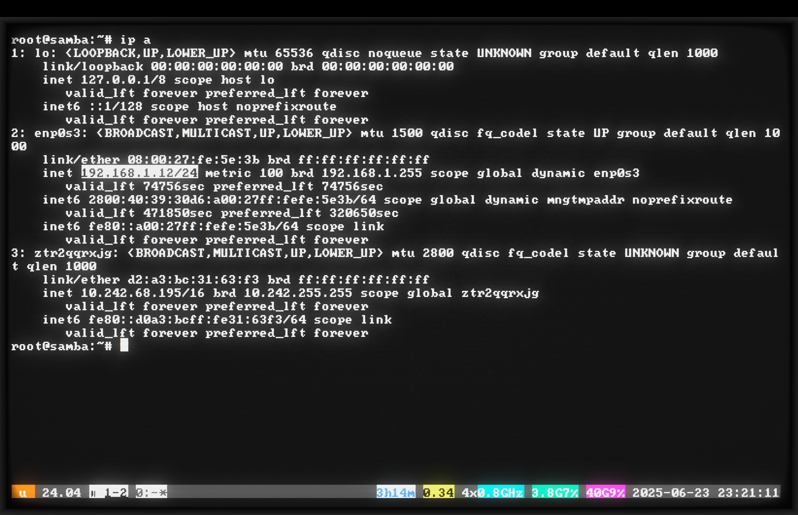
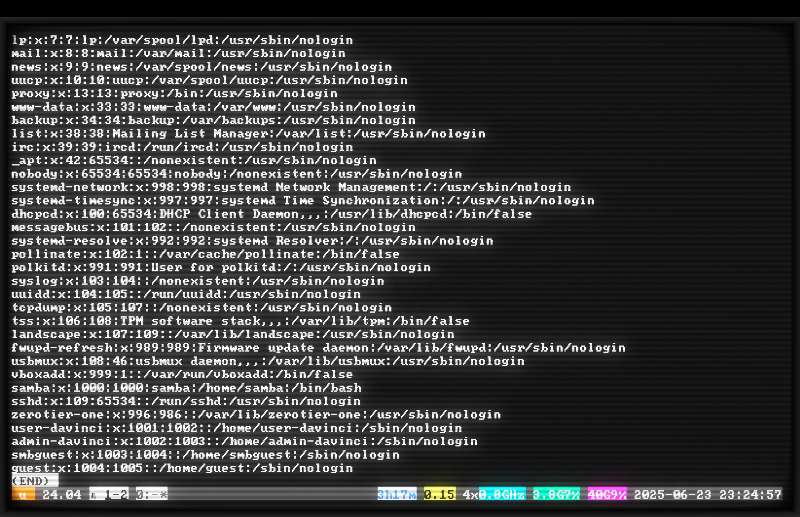
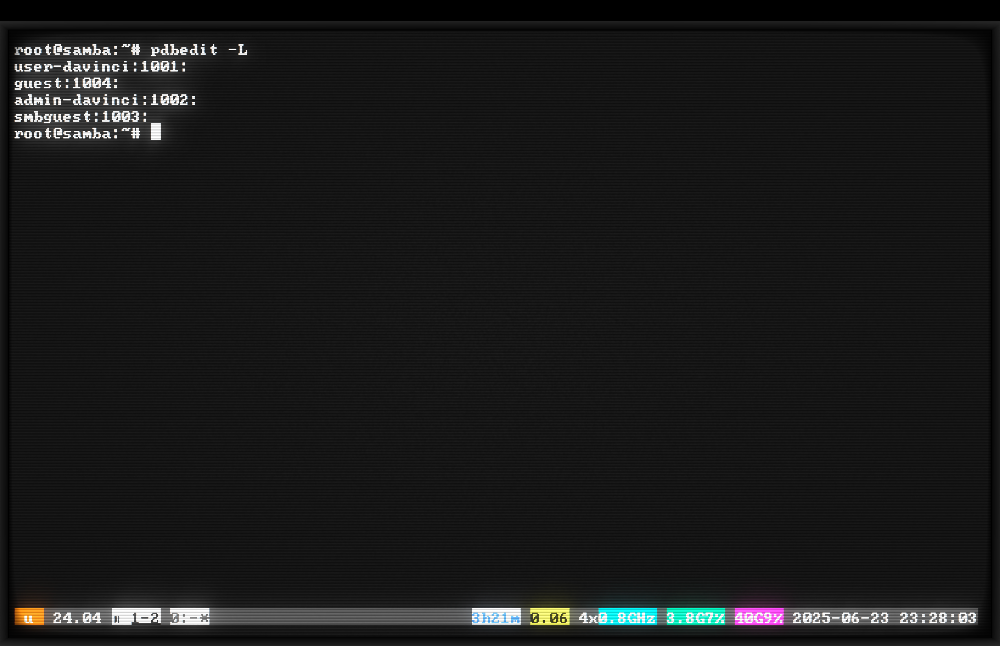
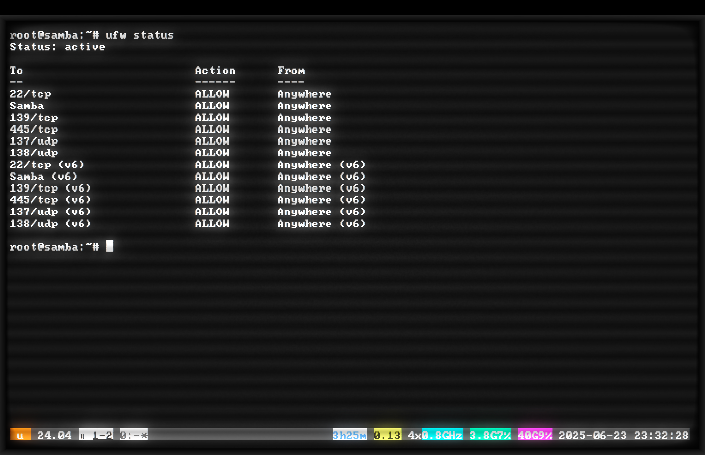

# Отчет о настройке файлового сервера Samba
## ACN3AP
## TP 2DO PARCIAL - Escuela DaVinci 2025
### Выполнили: Андрей Кобышев, Дмитрий Ведров

---
### [Посмотреть на GitHub](https://github.com/andrei-kobyshev-davinci-edu-ar/os1/blob/main/README.md)

## Введение: Зачем нам это все нужно?

С детства меня завораживали компьютеры. Помню школьный компьютерный класс с процессорами 386, зеленое свечение ЭЛТ-мониторов и Norton Commander. Эта ностальгия привела меня к использованию cool-retro-term — эмулятора терминала, который воссоздает эффект старых ЭЛТ-мониторов с их характерным мерцанием, искажениями по краям и теплым ламповым свечением. Работать в таком терминале — особое удовольствие для олдскульного гика!

### Но что мы вообще делаем в этом проекте?

**Представь себе строительную площадку:** есть главный офис (наш сервер), где хранятся все чертежи, документы и инструкции. Разные люди — от прораба до простого рабочего — должны иметь доступ к этим документам, но не ко всем одинаково. Прораб может видеть и изменять секретные сметы, инженер может читать их, но не менять, а рабочие вообще не должны их видеть.

**Наша задача** — создать именно такую систему, только в компьютерном мире. Мы строим файловый сервер Samba, который будет работать как общее хранилище документов для всех компьютеров в сети.

## Выбор и установка системы

### Выбор операционной системы (ОС)

**Аналогия из строительства:** Выбор ОС — это как выбор фундамента для дома. Можно залить монолитную плиту (Windows Server — дорого, но удобно), можно сделать ленточный фундамент (различные Linux дистрибутивы), а можно и на сваях построить (специализированные NAS системы).

Я выбрал **Ubuntu Server 24.04 LTS** потому что:
- **LTS (Long Term Support)** означает долгосрочную поддержку — как гарантия на стройматериалы на 5 лет
- Минимальные требования к ресурсам — как экономичный, но надежный фундамент
- Отличная поддержка Samba — все необходимые "строительные блоки" уже включены

### Создание виртуальной машины

**Что такое виртуальная машина?** Представь, что у тебя есть большой дом (твой компьютер), и ты решил выделить в нем отдельную квартиру-студию (виртуальную машину) со своим входом, коммуникациями и всем необходимым. Эта квартира полностью изолирована, но использует ресурсы большого дома.

В VirtualBox создал виртуальную машину с параметрами:
- **RAM: 4 ГБ** — это как выделить 4 комнаты под рабочее пространство
- **HDD: 40 ГБ** — место для хранения, как кладовка на 40 квадратных метров
- **Сеть: Bridged Adapter** — а вот это КРИТИЧЕСКИ ВАЖНО!

### Почему Bridged Adapter так важен?

**Строительная аналогия:** Представь многоквартирный дом с разными типами входов:
- **NAT (по умолчанию)** — это как квартира с выходом только через общий подъезд. Ты можешь выйти на улицу, но с улицы к тебе никто напрямую попасть не может
- **Bridged Adapter** — это как отдельный вход с улицы прямо в твою квартиру. Любой может прийти к тебе напрямую, зная твой адрес

Без Bridged Adapter другие компьютеры в сети просто не смогут найти наш сервер — он будет спрятан за NAT, как квартира без отдельного входа.

### Установка Ubuntu Server

Скачал ISO-образ с официального сайта ubuntu.com/download/server. 

**Что такое ISO-образ?** Это как чертеж или полный комплект строительной документации, упакованный в один файл. Ты "разворачиваешь" этот чертеж на виртуальной машине, и она строится по нему.

Выбрал именно версию **Server** — без графического интерфейса, только командная строка. Это как строить промышленное здание без красивой отделки — все функционально, ничего лишнего, экономия ресурсов.

При установке:
- Создал пользователя `samba` с паролем `samba` — это как выдать ключи от главного входа
- Активировал OpenSSH Server — это установка домофона для удаленного доступа

## Настройка сети и подключения

### Первое подключение и настройка SSH

```bash
# Проверил IP-адрес нашего сервера
ip a
# Получил 192.168.1.12
```

**IP-адрес** — это как почтовый адрес дома. Каждое устройство в сети имеет свой уникальный адрес, по которому к нему можно обратиться.

```bash
# С основного компьютера настроил SSH-ключи
ssh-copy-id samba@192.168.1.12
```


### Что такое SSH и зачем нужны ключи?

**Аналогия с замками:** 
- **Обычный пароль** — это как ключ от квартиры, который можно подделать или подсмотреть
- **SSH-ключи** — это как электронный замок с картой доступа. У тебя есть уникальная карта (приватный ключ), а на двери установлен считыватель (публичный ключ)

Команда `ssh-copy-id` устанавливает твой "считыватель" на сервер. Теперь можно входить без пароля — просто прикладываешь свою "карту".

### Использование byobu

```bash
ssh samba@192.168.1.12
byobu
sudo -i  # Переключился на root для удобства
```

**Что такое byobu?** Представь, что ты работаешь на стройке и вдруг пошел дождь. Обычно ты бы потерял все незаконченные работы. Byobu — это как навес, под которым твоя работа продолжается даже если ты ушел. Если связь оборвется (дождь), все процессы продолжат работать, и ты сможешь вернуться к ним позже.

## Установка Samba

### Что такое Samba?

**Samba** — это как универсальный переводчик между Windows и Linux. Представь строительную бригаду, где половина рабочих говорит по-русски (Linux), а половина по-испански (Windows). Samba — это прораб-переводчик, который помогает им понимать друг друга и работать с общими чертежами.

```bash
# Обновил систему — как проверка и замена старых инструментов
apt update && apt upgrade -y

# Установил Samba — наш главный "переводчик"
apt install samba smbclient -y
```

Проверка версии:
```bash
smbd --version
# Version 4.19.5-Ubuntu
```

Проверка статуса:
```bash
systemctl status smbd
# active (running) — значит "переводчик" на работе
```


**Про предупреждение:** Увидел предупреждение "Referenced but unset environment variable" — погуглил, оказалось это известная особенность Ubuntu 24.04. Это как небольшая царапина на новом инструменте — выглядит некрасиво, но на работу не влияет.

## Настройка пользователей и групп

### Зачем нужны пользователи и группы?

**Строительная аналогия:** На стройке есть:
- **Прораб** (admin-davinci) — полный доступ ко всему
- **Инженер** (user-davinci) — доступ к рабочим чертежам
- **Посетители** (smbguest) — могут только смотреть на информационные стенды

### Создание группы

```bash
groupadd sambagroup
```

**Группа** — это как бригада на стройке. Все, кто в бригаде, имеют определенные общие права и обязанности.

### Создание пользователей

```bash
# Администратор — главный прораб
useradd -M -s /sbin/nologin admin-davinci
usermod -aG sambagroup admin-davinci

# Обычный пользователь — инженер
useradd -M -s /sbin/nologin user-davinci
usermod -aG sambagroup user-davinci

# Гостевой пользователь — для посетителей
useradd -M -s /sbin/nologin smbguest
```



### Что означают эти странные параметры?

- **`-M`** — не создавать домашнюю папку. Это как выдать пропуск на стройку без выделения личного вагончика
- **`-s /sbin/nologin`** — запретить вход в систему Linux. Это как пропуск только в офис с чертежами, но не на саму стройплощадку

**Важно понимать:** Эти пользователи могут работать только с файлами через Samba, но не могут зайти на сам сервер. Это как охранник, который может открывать ворота для машин, но сам не имеет права входить на объект.

### Установка паролей для Samba

```bash
# Задаем пароли для работы с файлами
smbpasswd -a admin-davinci    # пароль: admin-davinci
smbpasswd -a user-davinci     # пароль: user-davinci  
smbpasswd -a smbguest        # пароль: guest

# Активируем пользователей
smbpasswd -e admin-davinci
smbpasswd -e user-davinci
smbpasswd -e smbguest
```



**Почему два вида паролей?** 
- Пароль Linux — для входа на сервер (мы его заблокировали)
- Пароль Samba — для доступа к файлам (это и используется)

Это как иметь ключ от входной двери (заблокирован) и отдельный ключ от офиса с документами (работает).

## Создание структуры папок

### План "строительства" папок

```bash
# Папка администратора — сейф с важными документами
mkdir -p /srv/samba/admin

# Папка пользователя — рабочий кабинет
mkdir -p /srv/samba/user

# Публичная папка — доска объявлений
mkdir -p /srv/samba/guest

# Создаем тестовые файлы — как образцы документов
echo "Admin only file - TP Samba 2025" > /srv/samba/admin/secret.txt
echo "User workspace file" > /srv/samba/user/document.txt
echo "Welcome! Public folder" > /srv/samba/guest/readme.txt
```

**Путь `/srv/samba/`** — это как отдельное крыло здания, специально выделенное под архив документов. В Linux принято хранить данные для сервисов именно в `/srv/`.

## Настройка прав доступа

### Система прав в Linux — это как система замков

```bash
# Устанавливаем владельцев папок
chown -R root:sambagroup /srv/samba/admin
chown -R root:sambagroup /srv/samba/user
chown -R nobody:nogroup /srv/samba/guest

# Устанавливаем права доступа
chmod -R 770 /srv/samba/admin
chmod -R 770 /srv/samba/user
chmod -R 777 /srv/samba/guest
```


### Расшифровка прав доступа (chmod)

**Права в Linux** — это три цифры, каждая от 0 до 7:
- **Первая цифра** — права владельца (хозяин квартиры)
- **Вторая цифра** — права группы (семья хозяина)
- **Третья цифра** — права всех остальных (гости)

Каждая цифра складывается из:
- **4** — читать (смотреть документы)
- **2** — писать (изменять документы)
- **1** — выполнять (для папок — входить)

**Примеры:**
- **770** = 7(4+2+1) для владельца, 7(4+2+1) для группы, 0 для остальных
  - Как квартира, где хозяин и семья могут все, а посторонние — ничего
- **777** = полный доступ для всех
  - Как общественная площадь — заходи кто хочешь

### Особенности папки Guest

- **Владелец nobody:nogroup** — это специальный "никто", безликий пользователь
- **Права 777** — любой может делать что угодно
- Это как доска объявлений на улице — пиши что хочешь

## Настройка Samba — самое важное!

### Конфигурационный файл — чертеж нашей системы

```bash
nano /etc/samba/smb.conf
```

### Глобальные настройки — фундамент

```ini
[global]
workgroup = WORKGROUP           # Название нашей "строительной компании"
server string = TP DaVinci - Kobyshev, Vedrov  # Вывеска на здании
netbios name = SAMBA-TP        # Короткое имя для старых систем
security = user                # Вход только по пропускам
map to guest = bad user        # Неизвестных отправляем в гостевую
guest account = smbguest       # Под каким именем пускаем гостей
```

### Настройки для современных Windows

```ini
# Протоколы — как языки общения
server min protocol = SMB2     # Минимум — современный язык
server max protocol = SMB3     # Максимум — самый новый язык

# Автообнаружение — как яркая вывеска
wins support = yes            # Включаем службу имен
local master = yes           # Становимся главным в районе
preferred master = yes       # Хотим быть главным
os level = 255              # Максимальный приоритет
```

**Аналогия:** Это как поставить самую яркую вывеску, самый громкий звонок и сказать всем: "Я тут главный сервер файлов!"

### Настройка папок — комнаты с разными замками

#### Папка администратора
```ini
[Admin]
comment = Admin folder - Full access for admin only
path = /srv/samba/admin        # Путь к папке
browsable = yes                # Видна в списке
guest ok = no                  # Гостей не пускаем
read only = no                 # Можно изменять
write list = admin-davinci     # Писать может только админ
read list = admin-davinci, user-davinci  # Читать могут админ и юзер
create mask = 0770             # Права для новых файлов
directory mask = 0770          # Права для новых папок
```

**Это как сейф:** Админ имеет полный доступ, инженер может заглянуть (прочитать), но не может ничего изменить, а рабочие вообще не видят этот сейф.

#### Папка пользователей
```ini
[User]
comment = User folder - All authenticated users
path = /srv/samba/user
browsable = yes
guest ok = no
read only = no
valid users = @sambagroup      # Доступ только для группы
create mask = 0770
directory mask = 0770
```

**Это как рабочий кабинет:** Все сотрудники компании (группа sambagroup) могут работать здесь как хотят.

#### Публичная папка
```ini
[Guest]
comment = Public folder - Open for everyone
path = /srv/samba/guest
browsable = yes
guest ok = yes                 # Пускаем всех
public = yes                   # Публичный доступ
read only = no                 # Можно писать
create mask = 0777             # Полные права для новых файлов
directory mask = 0777          # Полные права для новых папок
force user = smbguest          # Все работают от имени гостя
force group = nogroup          # В безликой группе
```

**Это как доска объявлений на входе:** Любой может читать и писать, даже без пропуска.

### Проверка и перезапуск

```bash
# Проверяем правильность настроек — как проверка чертежей
testparm

# Перезапускаем службы — как включение всех систем
systemctl restart smbd nmbd
```


## Настройка файрвола — охрана на входе

```bash
# Открываем порты для Samba
ufw allow samba
ufw status
```


**Файрвол (брандмауэр)** — это как КПП на входе. По умолчанию он никого не пускает. Команда `ufw allow samba` — это как сказать охране: "Пускай всех, кто идет в архив за документами".

## Особенности Windows 10/11 — капризные клиенты

### Проблема: Windows не видит сервер

**Почему так происходит?** Представь, что раньше все в районе знали друг друга и здоровались (старый протокол NetBIOS). Теперь все ходят в наушниках и смотрят в телефоны (новый протокол). Наш сервер кричит "Я тут!", но Windows его не слышит.

**Решение:** Подключаться напрямую по адресу `\\192.168.1.12`

### Проблема: Windows не пускает гостей

**Microsoft решил:** "Пускать всех подряд опасно!" И заблокировал анонимный доступ.

**Наше решение:** Создали пользователя smbguest с паролем guest. Это как выдать всем гостям временные пропуска с одинаковым номером.

## Тестирование — проверка всех замков

### Локальная проверка

```bash
# Смотрим, какие папки доступны
smbclient -L localhost -N
```


### Тестирование с Windows — финальная проверка

#### Тест 1: Гостевой доступ
1. Открываем `\\192.168.1.12\Guest`
2. Вводим: smbguest / guest
3. Создаем файл — работает!

**Результат:** Как и планировали — доска объявлений доступна всем.

#### Тест 2: Доступ инженера (user-davinci)
1. Подключаемся как user-davinci
2. В папке User — полный доступ ✓
3. В папке Admin — только чтение ✓
4. Попытка создать файл в Admin — отказано! ✓

**Результат:** Инженер может работать в своем кабинете и читать документы из сейфа, но не может их изменять.

#### Тест 3: Доступ администратора
1. Подключаемся как admin-davinci
2. Полный доступ везде ✓

**Результат:** Прораб — хозяин на стройке.

### Мониторинг активности

```bash
smbstatus
```


**Что мы видим:** user-davinci подключен к папке admin с правами RDONLY (Read Only — только чтение). Система работает правильно!

## Итоговая таблица доступа — кто куда может

| Папка | admin-davinci | user-davinci | smbguest (гость) |
|-------|--------------|--------------|------------------|
| Admin | Полный доступ | Только чтение | Нет доступа |
| User | Полный доступ | Полный доступ | Нет доступа |
| Guest | Полный доступ | Полный доступ | Полный доступ |

**Как это работает в жизни:**
- **Сейф (Admin)** — прораб хранит там сметы и секретные документы
- **Рабочий кабинет (User)** — все сотрудники работают с чертежами
- **Доска объявлений (Guest)** — информация для всех

## Полезные команды для управления

```bash
# Показать настройки — посмотреть все чертежи
testparm -s | grep -A5 "^\["

# Показать пользователей — список всех с пропусками
pdbedit -L

# Мониторинг подключений — кто сейчас в здании
smbstatus

# Показать права доступа — какие замки на дверях
ls -Ral /srv/samba/
```

## Выводы: Что мы построили и чему научились

### Что мы создали

Мы построили полноценную систему хранения файлов с разными уровнями доступа — как многоэтажное здание с разными зонами безопасности:

1. **Секретная зона** — только для руководства
2. **Рабочая зона** — для всех сотрудников
3. **Публичная зона** — открыта для всех

### Главные уроки

#### 1. Инфраструктура — фундамент всего
- **Bridged Adapter** — без него сервер как дом без дороги
- **SSH-ключи** — безопасный удаленный доступ
- **Byobu** — защита от обрывов связи

**Аналогия:** Это как построить дом (сервер) с хорошей дорогой (сеть), надежными замками (SSH) и генератором (byobu) на случай отключения электричества.

#### 2. Linux — это конструктор
- Пользователи и группы — кто есть кто
- Права доступа — кто куда может
- Службы (сервисы) — рабочие процессы

**Аналогия:** Linux как большая стройка, где каждый знает свою роль, у каждого есть свой уровень доступа, и все процессы работают по расписанию.

#### 3. Samba — мост между мирами
- Разница между пользователями Linux и Samba
- Гибкая настройка прав через конфигурацию
- Решение проблем совместимости

**Аналогия:** Samba как переводчик между строителями, говорящими на разных языках — все понимают друг друга и могут работать вместе.

#### 4. Windows 10/11 — сложный клиент
- Проблемы с автообнаружением
- Блокировка гостевого доступа
- Необходимость обходных решений

**Аналогия:** Современный Windows как привередливый заказчик — нужно знать все его особенности и требования.

### Практическая ценность

**Где это пригодится:**
1. **Малый офис** — общие документы для всех сотрудников
2. **Домашняя сеть** — семейное хранилище фото и видео
3. **Учебный класс** — раздача материалов студентам
4. **Мастерская** — хранение чертежей и документации

**Что можно улучшить в реальной жизни:**
- Подключить к Active Directory (корпоративная система входа)
- Настроить автоматическое резервное копирование
- Добавить квоты (ограничения по месту)
- Усилить безопасность (сложные пароли, шифрование)

## Шпаргалка: Быстрое развертывание

Если нужно повторить все быстро:

```bash
# Установка — закупка материалов
apt update && apt upgrade -y
apt install samba smbclient -y

# Структура — строительство помещений
mkdir -p /srv/samba/{admin,user,guest}

# Пользователи — выдача пропусков
groupadd sambagroup
useradd -M -s /sbin/nologin admin-davinci
useradd -M -s /sbin/nologin user-davinci
useradd -M -s /sbin/nologin smbguest
usermod -aG sambagroup admin-davinci
usermod -aG sambagroup user-davinci

# Права — установка замков
chown -R root:sambagroup /srv/samba/{admin,user}
chown -R nobody:nogroup /srv/samba/guest
chmod -R 770 /srv/samba/{admin,user}
chmod -R 777 /srv/samba/guest

# Пароли — программирование замков
smbpasswd -a admin-davinci    # пароль: admin-davinci
smbpasswd -a user-davinci     # пароль: user-davinci
smbpasswd -a smbguest        # пароль: guest
smbpasswd -e admin-davinci
smbpasswd -e user-davinci
smbpasswd -e smbguest

# Настройка — создание правил работы
# (редактировать /etc/samba/smb.conf)

# Безопасность — настройка охраны
ufw allow samba

# Запуск — включение всех систем
systemctl restart smbd nmbd
```

### Помни главное!

1. **Всегда проверяй настройки** через `testparm`
2. **Следи за правами доступа** — это основа безопасности
3. **Документируй изменения** — потом сам спасибо скажешь
4. **Тестируй с разных систем** — Windows любит сюрпризы
5. **Делай резервные копии** конфигурации перед изменениями

Этот проект — отличная база для понимания:
- Как работают сети
- Как организована безопасность в Linux
- Как разные системы общаются между собой
- Как решать реальные задачи системного администрирования

**Удачи в защите проекта!** Теперь ты знаешь не просто "как", но и "почему" все работает именно так. 


*P.S. А этот ретро-терминал действительно создает особую атмосферу работы — как будто ты хакер из 80-х, только с современными технологиями!*